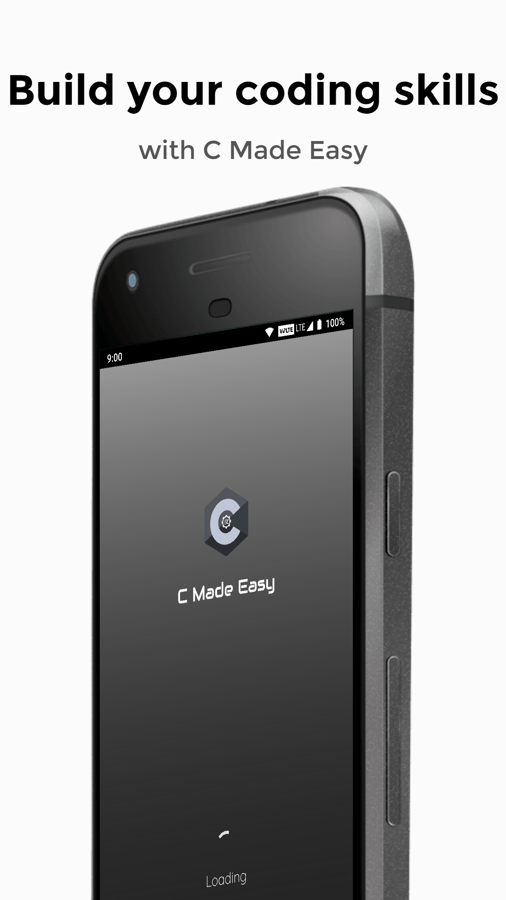
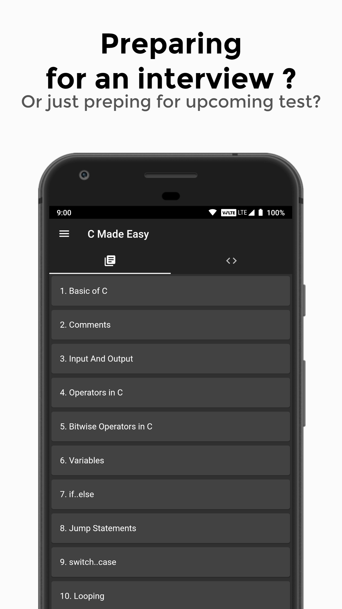
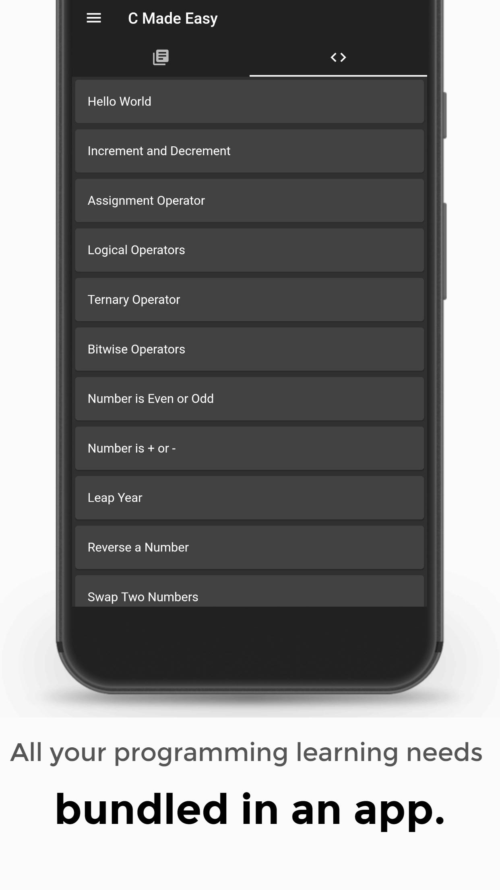
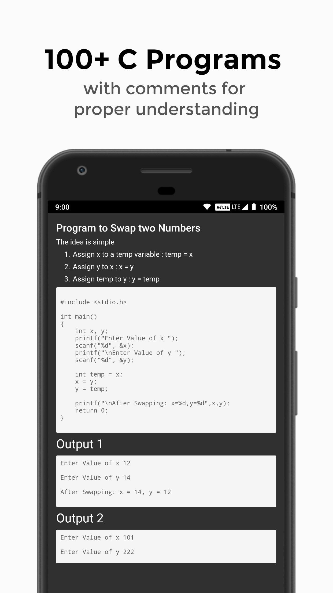
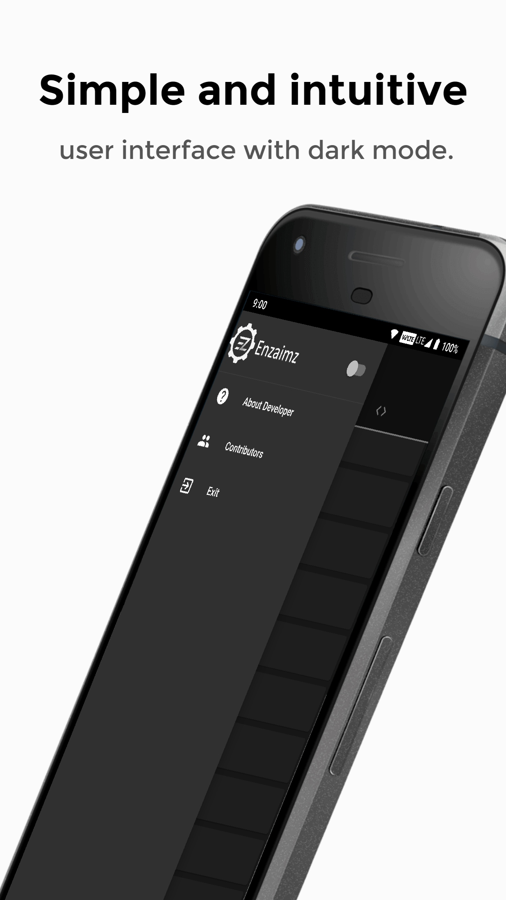

<h1 align="center">C_Made_Easy</h1>
<p align="center">
  <a href="https://github.com/enzaimz/c_made_easy/blob/master/assets/icon.png">
    
  </a>
  <h4 align="center">A Flutter-based Android App</h4>
</p>

This app is a complete free handbook for learning Basics of C Programming language which covers important topics, notes & programs on the course. Download the App as a reference material for Computer Science, Software Engineering programs & Degree courses.

C language is a powerful general-purpose programming language. If you are new to programming then C language is the best language to start your programming journey. In practical, C programming language is used in Embedded Systems, Systems Programming, Graphic Packages.

To join our channel click [here.](https://gitter.im/C_Made_Easy/community?utm_source=share-link&utm_medium=link&utm_campaign=share-link)

## Features
  - Contains all basic concepts of 'C' programming language.
  - C programs with comments for better understanding.
  - Very smooth User Interface.
  - Beautiful UI with multiple themes(Coming Soon).
 
  
  ### Show some :heart: and :star: the repo to support the project.
  
  

## Contribution is welcome! 🎉


## Prerequisites☑
- Ability to use Git and Github :octocat:
- Basic knowledge of Dart and Flutter
- Willingness to learn more
- UI/UX skills are appreciable but not mandatory

  
## Screenshots
  
     
  

## Setting up the Development Environment 

- **Flutter**
  - Follow the instructions in the [Flutter docs](https://flutter.dev/docs/get-started/install) according to your OS.
  
- **Visual Studio Code** or any other editor supporting flutter.
  - VS Code is [available here.](https://code.visualstudio.com/#alt-downloads)

- **Android Studio** install [available here.](https://developer.android.com/studio)

- To set-up the development environment refer [here.](https://flutter.dev/docs/get-started/install)

## Setting up the Project

- Fork the repository. Click the "**Fork**" button in the top right of the page.
- Clone the repository:
  - You can clone the repo to your machine using the command listed below:
    ```bash
    git clone https://github.com/user-name/c_made_easy
    ```
    *Note: Replace "user-name" with your Github username.*
     
- Add the upstream remote:   
  - You can use the command listed below:
  ```bash
    git remote add upstream https://github.com/enzaimz/c_made_easy
    ```


## Running the project locally
- Open the project directory in your editor. 
- Click on the Debug/Run button.


## Keeping the project updated
To update your local copy to the latest upstream commit, run the following commands:
- Fetch all branches of remote upstream:
```bash
git fetch upstream
```
- Rewrite your master with upstream’s master using git rebase:
```base
git rebase upstream/master
```
- Push your updates to master:
```base
git push origin master --force or git push -f origin master
```

*Note: make sure that "master" is your current branch*.


# Available on Google Play
<a href="https://play.google.com/store/apps/details?id=com.enzaimz.c_syntax"></p>


